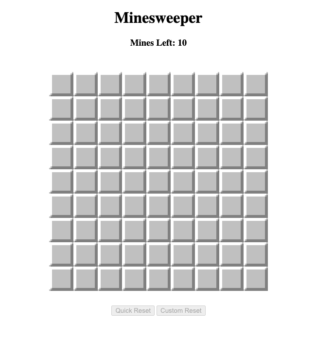
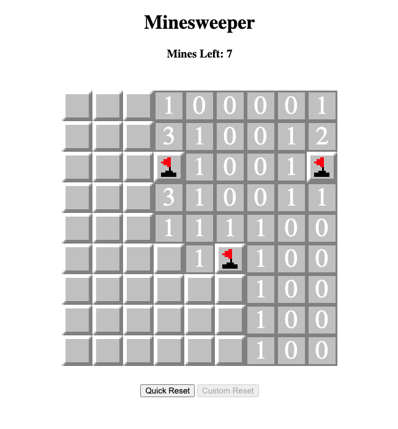
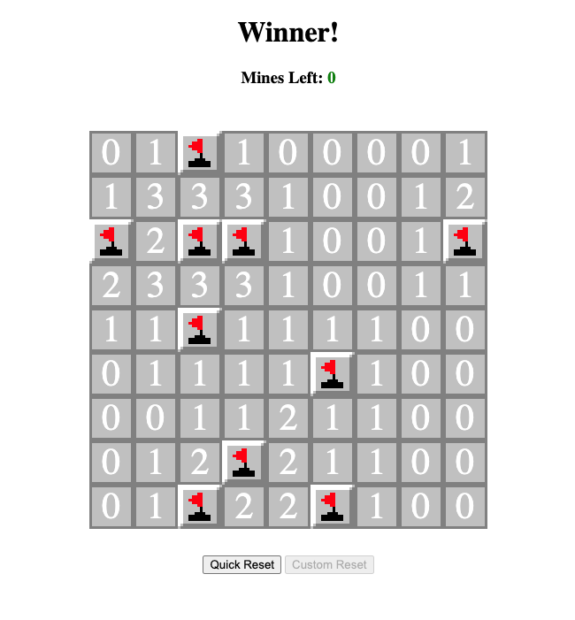
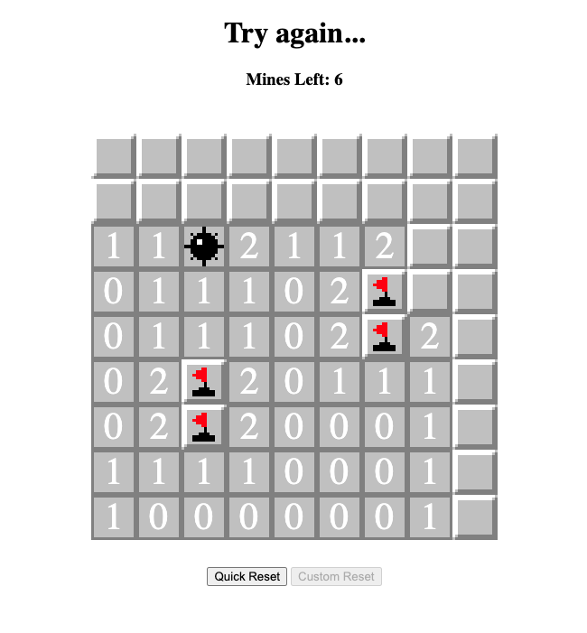

# Minesweeper!

## Minesweeper, an introduction
Since the dawn of time (well, since Windows 3.1 at least) peopple have been playing minesweeper...

**Goal of the Game**
In order to win, reveal all the safe squares on the board without exploding a mine. 

**How to Play**
Click on any unrevealed square to start the game. Numbers on the squares indicate the number of surrounding mines (this includes all 8 squares surrounding it in a 3×3 grid). Based on these numbers and how their 3×3 grids overlap, you can identify or suspect under which squares mines are hidden.

Place a flag by right clicking to mark it as dangerous. Reveal all safe squares without mines to win the game.

## Screenshots

## Technologies Used
- Javascript
- CSS
- HTML

## Getting Started
[Try out my game!](https://mgrimley.github.io/Minesweeper/)

## Next Steps